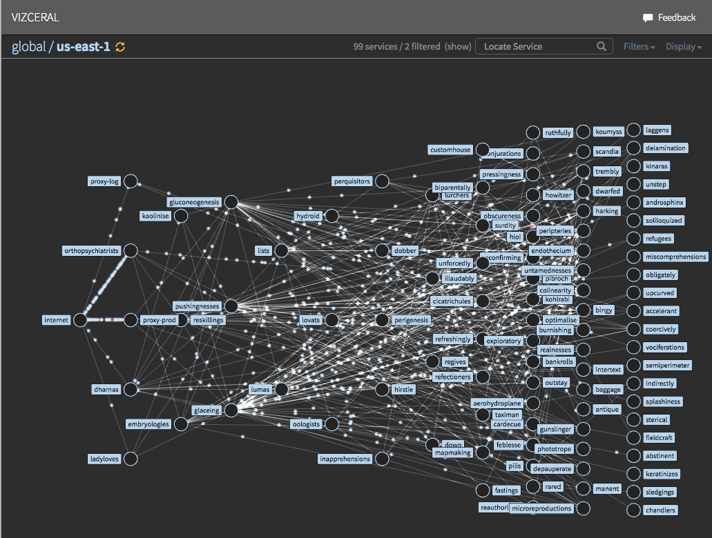

# vizceral

vizceral is a component for displaying traffic data on a webgl canvas. If a graph of nodes and edges with data about traffic volume is provided, it will render a traffic graph animating the connection volume between nodes.

This component can take multiple traffic graphs and will generate a 'global' graph showing all incoming traffic into each of the 'regions', with support for cross-region traffic.

There are three levels of information, global, regional, and service-level, with clicking or double-clicking on a node bringing you one level deeper.

## Using

See [the wiki](https://github.com/Netflix/vizceral/wiki) for full documentation.

## Developing Locally

To see your changes to `vizceral` locally, you'll need to link the package with bower:

    $ git clone git@github.com:Netflix/vizceral.git
    $ cd vizceral
    $ npm link
    $ npm run dev
    $ cd /path/to/project-using-vizceral
    $ npm link vizceral

## Contributing

1.  Clone this repo
2.  Create a branch: `git checkout -b your-feature`
3.  Make some changes
4.  Test your changes by [running your local version](#developing-locally)
5.  Push your branch and open a Pull Request

## Supported Browsers

Current development focuses on most recent version of Chrome. Minor sanity checking for the latest versions of Safari and Firefox.

## TODO

- Unit Tests
- Modular layout algorithms
  - Smarter current layout algorithm
- Cross-browser support / testing
- Create predefined locations and design styles to modularly represent custom metadata
- Implement redesigned third-level view

## License

Code released under [the Apache 2.0 license](./LICENSE).
